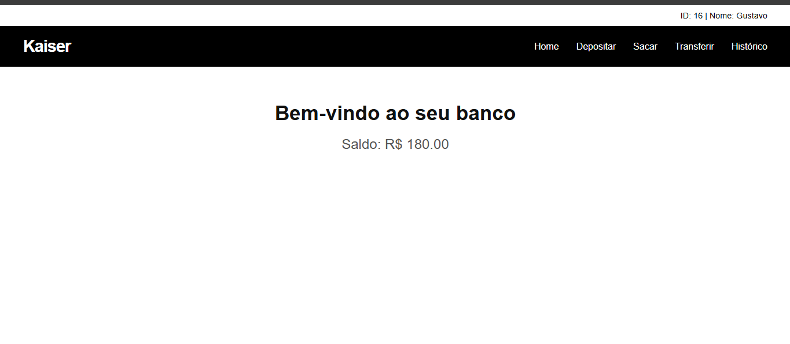

# 💰 Sistema Bancário

Projeto de sistema para gerenciamento de uma **agência bancária** com algumas funcionalidades. este projeto simula as principais operações bancárias de forma simples.

---

## 🚀 Funcionalidades

- ✅ Cadastro e login de usuários (via CPF)
- 💸 Depósito de valores
- 🏦 Saque com verificação de saldo
- 🔁 Transferência entre contas cadastradas
- 📊 Consulta de saldo atual
- 📋 Histórico de transações

---

## 🛠️ Tecnologias Utilizadas

### Back-end:
- Spring Web
- Spring Data JPA
- MySQL Driver
- Lombok
- Spring Boot DevTools
- Spring Security

### Front-end:
- HTML5
- CSS3
- JavaScript (puro)
  

